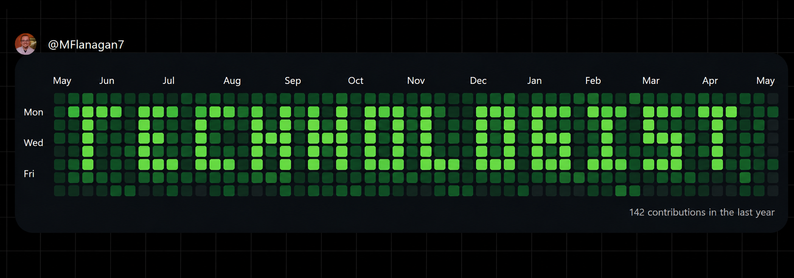

### Hi, I'm Michael 👋

**Marketing Technologist & HubSpot Developer** based in Oklahoma City.

I build and optimize web experiences that drive real business outcomes. Currently at WEOKIE Federal Credit Union, where I sole-implemented a full website redesign for a $1.5B financial institution: 20+ custom HubSpot modules, 3 custom templates, 150+ pages migrated from a legacy codebase.

I work at the intersection of marketing operations and frontend development, and I integrate AI tooling (Claude, Claude Code, HubSpot Breeze) into daily development and content workflows.

#### What I'm working with

`HubSpot CMS` · `HubL` · `JavaScript` · `HTML` · `CSS` · `React` · `Next.js` · `TypeScript` · `Tailwind` · `Claude Code` · `Google Analytics`

#### Currently

- 🔭 Building a Next.js portfolio with a custom design system
- 📚 Certifying in Integrating With HubSpot I: Foundations
- 🎓 Finishing my BS in Computer Science at the University of Central Oklahoma
- 🤖 Planning AI features for an upcoming site build

#### Links

- 🌐 Portfolio: [michaelflanagan.dev](https://www.michaelflanagan.dev/)
- 🪪 Infocard: [infocard.ai/~MFlanagan7](https://infocard.ai/~MFlanagan7)
- 💼 LinkedIn: [michael-flanagan](https://linkedin.com/in/michael-flanagan)
- ✉️ Email: mflanagan7@gmail.com

#### Open to

Full-time, contract, consulting, freelance, and part-time roles where development and marketing strategy intersect. Comfortable on-site in Oklahoma City, hybrid, or fully remote.
